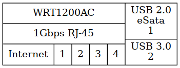

#+SETUPFILE: ~/notebook/config/publish/templates/level-3.org
#+TITLE: Linksys WRT1200ACv1
#+DATE: 2025-12-04
#+AUTHOR: whk (https://whk.name/about/me)
#+EMAIL: develop@whk.name
#+SUBTITLE:
#+DESCRIPTION: Hardware Details
#+KEYWORDS:
#+STARTUP: content
* Introduction
:documentMetadata:
#+BEGIN_details
#+HTML:
Document Metadata

+ Copyright:
  - SPDX-License-Identifier: CC-BY-SA-4.0 or AGPL-3.0-or-later
  - SPDX-FileCopyrightText: © 2025 WHK <develop@whk.name>
  - See {{{insertRelativeLink(about/licensing/,Licensing)}}} for more details
+ Author: {{{author}}}
+ Created: {{{date}}}
+ Changes
  - 2025-12-04: Created
#+END_details
:END:

| S/N            | Label        | Configuration     |
| 16R10604529991 | WRT1200AC-01 | [[../os-openwrt/index.org::*labDesk][OpenWRT - labDesk]] |
|                |              |                   |

** Model Information

#+CAPTION:WRT1200ACv1
#+begin_src dot :file wrt1200ac.png :cmd dot :cmdline -Tpng -owrt1200ac.png :eval no-export
  graph wrt1200ac {
    WRT1200AC [shape = "record"
	       label="{\N|"+
		 "1Gbps RJ-45|"+
		 "{<wan>Internet|<1>1|<2>2|<3>3|<4>4}}|"+
		 "{<usb1> USB 2.0\neSata\n1|<usb 2> USB 3.0\n2}"]

  }
#+end_src

#+RESULTS:

| Manufacture      | Linksys                       |
| Model            | wrt1200acv1                   |
| Name             | Dual-Band Gigabit WiFi-Router |
| OEM Docs         |                               |
| 5xEthernet       | 10/100/1000 RJ-45             |
| USB              | 1xUSB2.0/eSata, 1xUSB3.0      |
| Default Password | admin                         |

* File Listings
** ~index.org~
#+BEGIN_details
#+HTML: 
The index.org source file for this page

#+INCLUDE: "index.org" example
#+END_details
