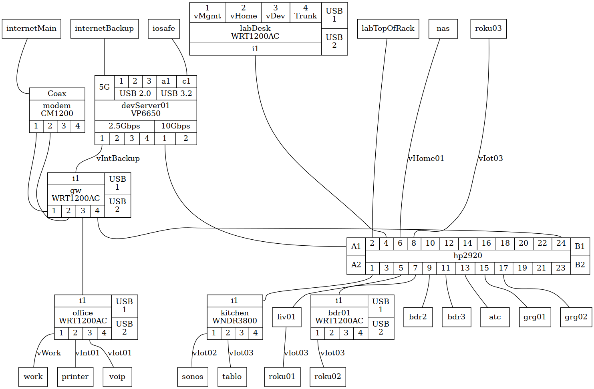

#+SETUPFILE: ~/notebook/config/publish/templates/level-3.org
#+TITLE: Home Network Layout
#+DATE: 2025-12-03
#+AUTHOR: whk (https://whk.name/about/me)
#+EMAIL: develop@whk.name
#+SUBTITLE:
#+DESCRIPTION: Describes the Physical and Logical Layout of my home network
#+KEYWORDS:
#+STARTUP: content
* Introduction
:documentMetadata:
#+BEGIN_details
#+HTML:
Document Metadata

+ Copyright:
  - SPDX-License-Identifier: CC-BY-SA-4.0 or AGPL-3.0-or-later
  - SPDX-FileCopyrightText: © 2025 WHK <develop@whk.name>
  - See {{{insertRelativeLink(about/licensing/,Licensing)}}} for more details
+ Author: {{{author}}}
+ Created: {{{date}}}
+ Changes
  - 2025-12-03: Created
#+END_details
:END:

* Physical Connections
#+CAPTION: Physical Connections
#+ATTR_HTML: :usemap "#physical"
#+begin_src dot :file physical.png :cmd dot :cmdline -Tcmapx -ophysical.map -Tpng -ophysical.png :eval no-export
  graph physical {
    # Default Attributes
    fontsize=8
    # Default node Attributes
    node [shape = "record"]
    # Default edge attributes
    edge [arrowhead=none label="" style=solid labelURL=""]

    ## Cable Modem
    modem [
	    label="{<cbl> Coax|\N\nCM1200|{<1>1|<2>2|<3>3|<4>4}}"
	    URL="../hw-netgear-cm1200-cablemodem/index.html"
	    ]

    ## WNDR3800
    node [label="{<wan>i1|"+
		  "\N\nWNDR3800|"+
		  "{<1>1|<2>2|<3>3|<4>4}}"]
    kitchen

    ## WRT1200AC
    node [label="{<wan>i1|"+
		  "\N\nWRT1200AC|"+
		  "{<1>1|<2>2|<3>3|<4>4}}|"+
		"{<usb1> USB\n1|<usb 2> USB\n2}"]
    gw
    office
    bdr01
    labDesk [label="{{<1>1\nvMgmt|<2>2\nvHome|<3>3\nvDev|<4>4\nTrunk}|"+
		  "\N\nWRT1200AC|"+
		  "<wan>i1}|"+
		"{<usb1> USB\n1|<usb 2> USB\n2}"]

    ## hp2920 switch
    hp2920 [label="{<a1>A1|<a2>A2}|"+
	      "{{<2>2|<4>4|<6>6|<8>8|<10>10|<12>12|<14>14|<16>16|<18>18|<20>20|<22>22|<24>24}|"+
	      "\N|"+
	      "{<1>1|<3>3|<5>5|<7>7|<9>9|<11>11|<13>13|<15>15|<17>17|<19>19|<21>21|<23>23}}|"+
	      "{<b1>B1|<b2>B2}"]

    ## Protectli vp6650
    devServer01 [label="{{<int1>5G|{{<usb1>1|<usb2>2|<usb3>3}|USB 2.0}|{{<usba1>a1|<usbc1>c1}|USB 3.2}}|"+
	       "\N\nVP6650|"+
	       "{{2.5Gbps|{<1>1|<2>2|<3>3|<4>4}}|{10Gbps|{<s1>1|<s2>2}}}}"]

    ## Default label again
    node [label="\N"]

    ## Connections
    internetMain -- modem:cbl
    modem:1 -- gw:1
    modem:2 -- gw:2
    gw:4 -- hp2920:24
    gw:3 -- office:wan

    internetBackup -- devServer01:int1
    iosafe -- devServer01:usbc1
    devServer01:1 -- gw:wan [label="vIntBackup"] 
    devServer01:s1 -- hp2920:b2

    hp2920:1 -- kitchen:wan
    hp2920:5 -- liv01
    hp2920:7 -- bdr01:wan
    hp2920:9 -- bdr2
    hp2920:11 -- bdr3
    hp2920:13 -- atc
    hp2920:15 -- grg01
    hp2920:17 -- grg02
    labTopOfRack -- hp2920:2
    labDesk:wan -- hp2920:4
    nas -- hp2920:6 [label="vHome01"]

    office:1 -- work [label="vWork"]
    office:2 -- printer [label="vInt01"]
    office:3 -- voip [label="vIot01"]

    kitchen:1 -- sonos [label="vIot02"]
    kitchen:2 -- tablo [label="vIot03"]

    liv01 -- roku01 [label="vIot03"]
    bdr01:1 -- roku02 [label="vIot03"]
    roku03 -- hp2920:8 [label="vIot03"]

    //{rank=same gw hp2920}
    {rank=min internetMain internetBackup labTopOfRack labDesk nas roku03}
    {rank=same kitchen liv01 office bdr01 bdr2 bdr3 atc grg01 grg02}
    {rank=max work printer voip sonos tablo roku01 roku02}
  }
#+end_src

#+RESULTS:

* Logical Connections

** Subnets

*** Default/Guest (10.77.1.0/24)
- 10.77.1.0/24 will be the Default/Guest vlan that is only routed to internet

*** Management (10.77.2.0/24)
- 10.77.2.0/24 will be the managment (mgmt) vLan for network and system access
  
*** Home (10.77.3.0/24)
Put Home and iot vlans inside the same /24 space (since some devices
(e.g. roku) need it for an app on phone/tablet to discover them, but
put them in different subnets of that space so I can firewall.

| Network      |  Usable |    | Brdcast |   GW | vLan      | Use                   |
|              |   Range |  # |         |      |           |                       |
|--------------+---------+----+---------+------+-----------+-----------------------|
| 0.0.0.0/26   |    1-62 | 62 |     .63 |  .62 | home/20   | Personal Devices      |
| 0.0.0.64/28  |   65-78 | 14 |     .79 |  .78 | home01/21 | NAS                   |
| 0.0.0.80/28  |   81-94 | 14 |     .95 |  .94 | home02/22 | TBD                   |
| 0.0.0.96/29  |  97-102 |  6 |    .103 | .102 | home03/23 | printer, scannedNAS   |
| 0.0.0.104/29 | 105-110 |  6 |    .111 | .110 | home04/24 | TBD                   |
| 0.0.0.112/29 | 113-118 |  6 |    .119 | .118 | home05/25 | TBD                   |
| 0.0.0.120/29 | 121-126 |  6 |    .127 | .126 | home06/26 | TBD                   |
| 0.0.0.128/27 | 129-158 | 30 |    .159 | .158 | iot1/101  | tablo, roku, mediasrv |
| 0.0.0.160/29 | 161-166 |  6 |    .167 | .166 | iot2/102  | sonos                 |
| 0.0.0.168/29 | 169-174 |  6 |    .175 | .174 | iot3/103  | voip                  |
| 0.0.0.176/29 | 177-182 |  6 |    .183 | .182 | iot4/104  | thermostat            |
| 0.0.0.184/29 | 185-190 |  6 |    .191 | .190 | iot5/105  | TBD                   |
| 0.0.0.192/29 | 193-198 |  6 |    .199 | .198 | iot6/106  | TBD                   |
| 0.0.0.200/29 | 201-206 |  6 |    .207 | .206 | iot7/107  | TBD                   |
| 0.0.0.208/29 | 209-214 |  6 |    .215 | .214 | iot8/108  | TBD                   |
| 0.0.0.216/29 | 217-222 |  6 |    .223 | .222 | iot9/109  | TBD                   |
| 0.0.0.224/29 | 225-230 |  6 |    .231 | .230 | iot10/110 | TBD                   |
| 0.0.0.232/29 | 233-238 |  6 |    .239 | .238 | iot11/111 | TBD                   |
| 0.0.0.240/29 | 241-246 |  6 |    .247 | .247 | iot12/112 | TBD                   |
| 0.0.0.248/29 | 249-254 |  6 |    .255 | .254 | iot13/113 | TBD                   |

*** Work (10.77.4.0/24)
- 10.77.4.0/24 is the work vlan which is isolated from all other vlans
  and only routed to internet

*** Development networks (10.77.128.0/17)
- 10.77.128.0/17 is allocated to development work and will be
  subneted as needed
| Network      | Usable |     | Brdcast |   GW | vLan      | Use          |
|              |  Range |   # |         |      |           |              |
|--------------+--------+-----+---------+------+-----------+--------------|
| 0.0.128.0/24 |  1-254 | 254 |    .255 | .254 | dev01/200 | Dev - Main   |
| 0.0.129.0/24 |  1-254 | 254 |    .255 | .254 | dev02/201 | Dev - Mgmt   |
| 0.0.130.0/24 |  1-254 | 254 |    .255 | .254 | dev03/203 | New rtr temp |
|              |        |     |         |      |           |              |

* File Listings
** ~index.org~
#+BEGIN_details
#+HTML: 
The index.org source file for this page

#+INCLUDE: "index.org" example
#+END_details
