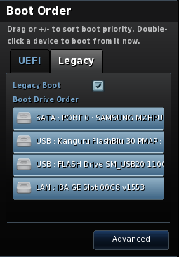
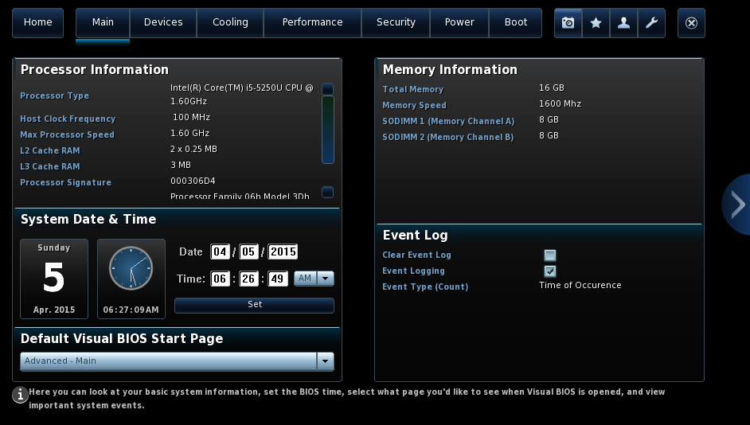
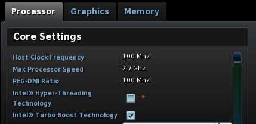

---
nocite: |
 @GentooProjecta, @Sakaki, @whk
---

Comments
============================================================
My second attempt at a Development workstation config.  Features:

* Encrypted Drive
* btrfs filesystem


Hardware Configuration
============================================================

* Installed items

Item       Version
-------    -------------
Model      BOXNUC5i5RYK
CPU        Intel Core i5-5250U
Memory     G.SKILL Ripjaws Series 16GB (2 x 8G) 204-Pin DDR3 SO-DIMM DDR3L 1600 (PC3L 12800) Laptop Memory Model F3-1600C9D-16GRSL
Hard Drive SAMSUNG XP941 MZHPU256HCGL-00000 M.2 256GB PCI Express MLC Enterprise Solid State Drive - OEM

* PCI info (as reported by live usb)

    ```
    00:00.0 Host bridge: Intel Corporation Broadwell-U Host Bridge -OPI (rev 09)
        Subsystem: Intel Corporation Device 2057
        Flags: bus master, fast devsel, latency 0
        Capabilities: [e0] Vendor Specific Information: Len=0c <?>

    00:02.0 VGA compatible controller: Intel Corporation Broadwell-U Integrated Graphics (rev 09) (prog-if 00 [VGA controller])
        Subsystem: Intel Corporation Device 2057
        Flags: bus master, fast devsel, latency 0, IRQ 56
        Memory at f6000000 (64-bit, non-prefetchable) [size=16M]
        Memory at e0000000 (64-bit, prefetchable) [size=256M]
        I/O ports at f000 [size=64]
        Expansion ROM at <unassigned> [disabled]
        Capabilities: [90] MSI: Enable+ Count=1/1 Maskable- 64bit-
        Capabilities: [d0] Power Management version 2
        Capabilities: [a4] PCI Advanced Features
        Kernel driver in use: i915

    00:03.0 Audio device: Intel Corporation Broadwell-U Audio Controller (rev 09)
        Subsystem: Intel Corporation Device 2057
        Flags: bus master, fast devsel, latency 0, IRQ 60
        Memory at f7234000 (64-bit, non-prefetchable) [size=16K]
        Capabilities: [50] Power Management version 2
        Capabilities: [60] MSI: Enable+ Count=1/1 Maskable- 64bit-
        Capabilities: [70] Express Root Complex Integrated Endpoint, MSI 00
        Kernel driver in use: snd_hda_intel
        Kernel modules: snd_hda_intel

    00:14.0 USB controller: Intel Corporation Wildcat Point-LP USB xHCI Controller (rev 03) (prog-if 30 [XHCI])
        Subsystem: Intel Corporation Device 2057
        Flags: bus master, medium devsel, latency 0, IRQ 58
        Memory at f7220000 (64-bit, non-prefetchable) [size=64K]
        Capabilities: [70] Power Management version 2
        Capabilities: [80] MSI: Enable+ Count=1/8 Maskable- 64bit+
        Kernel driver in use: xhci_hcd
        Kernel modules: xhci_hcd

    00:16.0 Communication controller: Intel Corporation Wildcat Point-LP MEI Controller #1 (rev 03)
        Subsystem: Intel Corporation Device 2057
        Flags: bus master, fast devsel, latency 0, IRQ 255
        Memory at f723c000 (64-bit, non-prefetchable) [size=32]
        Capabilities: [50] Power Management version 3
        Capabilities: [8c] MSI: Enable- Count=1/1 Maskable- 64bit+

    00:19.0 Ethernet controller: Intel Corporation Ethernet Connection (3) I218-V (rev 03)
        Subsystem: Intel Corporation Device 2057
        Flags: bus master, fast devsel, latency 0, IRQ 59
        Memory at f7200000 (32-bit, non-prefetchable) [size=128K]
        Memory at f723a000 (32-bit, non-prefetchable) [size=4K]
        I/O ports at f060 [size=32]
        Capabilities: [c8] Power Management version 2
        Capabilities: [d0] MSI: Enable+ Count=1/1 Maskable- 64bit+
        Capabilities: [e0] PCI Advanced Features
        Kernel driver in use: e1000e
        Kernel modules: e1000e

    00:1b.0 Audio device: Intel Corporation Wildcat Point-LP High Definition Audio Controller (rev 03)
        Subsystem: Intel Corporation Device 2057
        Flags: bus master, fast devsel, latency 32, IRQ 61
        Memory at f7230000 (64-bit, non-prefetchable) [size=16K]
        Capabilities: [50] Power Management version 3
        Capabilities: [60] MSI: Enable+ Count=1/1 Maskable- 64bit+
        Kernel driver in use: snd_hda_intel
        Kernel modules: snd_hda_intel

    00:1c.0 PCI bridge: Intel Corporation Wildcat Point-LP PCI Express Root Port #1 (rev e3) (prog-if 00 [Normal decode])
        Flags: bus master, fast devsel, latency 0
        Bus: primary=00, secondary=01, subordinate=01, sec-latency=0
        Capabilities: [40] Express Root Port (Slot-), MSI 00
        Capabilities: [80] MSI: Enable- Count=1/1 Maskable- 64bit-
        Capabilities: [90] Subsystem: Intel Corporation Device 2057
        Capabilities: [a0] Power Management version 3
        Kernel driver in use: pcieport

    00:1c.3 PCI bridge: Intel Corporation Wildcat Point-LP PCI Express Root Port #4 (rev e3) (prog-if 00 [Normal decode])
        Flags: bus master, fast devsel, latency 0
        Bus: primary=00, secondary=02, subordinate=02, sec-latency=0
        Memory behind bridge: f7100000-f71fffff
        Capabilities: [40] Express Root Port (Slot+), MSI 00
        Capabilities: [80] MSI: Enable- Count=1/1 Maskable- 64bit-
        Capabilities: [90] Subsystem: Intel Corporation Device 2057
        Capabilities: [a0] Power Management version 3
        Capabilities: [100] #00
        Capabilities: [200] L1 PM Substates
        Kernel driver in use: pcieport

    00:1c.4 PCI bridge: Intel Corporation Wildcat Point-LP PCI Express Root Port #5 (rev e3) (prog-if 00 [Normal decode])
        Flags: bus master, fast devsel, latency 0
        Bus: primary=00, secondary=03, subordinate=03, sec-latency=0
        Memory behind bridge: f7000000-f70fffff
        Capabilities: [40] Express Root Port (Slot+), MSI 00
        Capabilities: [80] MSI: Enable- Count=1/1 Maskable- 64bit-
        Capabilities: [90] Subsystem: Intel Corporation Device 2057
        Capabilities: [a0] Power Management version 3
        Capabilities: [100] #00
        Capabilities: [200] L1 PM Substates
        Kernel driver in use: pcieport

    00:1d.0 USB controller: Intel Corporation Wildcat Point-LP USB EHCI Controller (rev 03) (prog-if 20 [EHCI])
        Subsystem: Intel Corporation Device 2057
        Flags: bus master, medium devsel, latency 0, IRQ 23
        Memory at f7239000 (32-bit, non-prefetchable) [size=1K]
        Capabilities: [50] Power Management version 3
        Capabilities: [58] Debug port: BAR=1 offset=00a0
        Capabilities: [98] PCI Advanced Features
        Kernel driver in use: ehci-pci
        Kernel modules: ehci_pci

    00:1f.0 ISA bridge: Intel Corporation Wildcat Point-LP LPC Controller (rev 03)
        Subsystem: Intel Corporation Device 2057
        Flags: bus master, medium devsel, latency 0
        Capabilities: [e0] Vendor Specific Information: Len=0c <?>

    00:1f.3 SMBus: Intel Corporation Wildcat Point-LP SMBus Controller (rev 03)
        Subsystem: Intel Corporation Device 2057
        Flags: medium devsel, IRQ 18
        Memory at f7238000 (64-bit, non-prefetchable) [size=256]
        I/O ports at f040 [size=32]
        Kernel modules: i2c_i801

    02:00.0 Network controller: Intel Corporation Wireless 7265 (rev 59)
        Subsystem: Intel Corporation Dual Band Wireless-AC 7265
        Flags: bus master, fast devsel, latency 0, IRQ 62
        Memory at f7100000 (64-bit, non-prefetchable) [size=8K]
        Capabilities: [c8] Power Management version 3
        Capabilities: [d0] MSI: Enable+ Count=1/1 Maskable- 64bit+
        Capabilities: [40] Express Endpoint, MSI 00
        Capabilities: [100] Advanced Error Reporting
        Capabilities: [140] Device Serial Number 34-13-e8-ff-ff-23-68-ec
        Capabilities: [14c] Latency Tolerance Reporting
        Capabilities: [154] L1 PM Substates
        Kernel driver in use: iwlwifi
        Kernel modules: iwlwifi

    03:00.0 SATA controller: Samsung Electronics Co Ltd XP941 PCIe SSD (rev 01) (prog-if 01 [AHCI 1.0])
        Subsystem: Samsung Electronics Co Ltd Device a811
        Flags: bus master, fast devsel, latency 0, IRQ 57
        Memory at f7010000 (32-bit, non-prefetchable) [size=8K]
        Expansion ROM at f7000000 [disabled] [size=64K]
        Capabilities: [40] Power Management version 3
        Capabilities: [50] MSI: Enable+ Count=1/2 Maskable+ 64bit+
        Capabilities: [70] Express Endpoint, MSI 00
        Capabilities: [d0] Vital Product Data
        Capabilities: [100] Advanced Error Reporting
        Capabilities: [140] Device Serial Number 00-00-00-00-00-00-00-00
        Capabilities: [150] Power Budgeting <?>
        Capabilities: [160] Latency Tolerance Reporting
        Kernel driver in use: ahci
        Kernel modules: ahci
    ```


Preconfiguration
===============================================================================================
* Turn off legacy boot mode (enables network after restart)

    * &lt;F2> on boot to enter bios

    * Uncheck Legacy Boot

        

    * &lt;F10> to save and exit

* Update Bios

    * &lt;F2> on boot to enter bios

    * &lt;F7> to update check for updates and update bios

* Other settings

    * &lt;F2> on boot to enter bios

    * Select advanced page

        

    * Set advanced as Default

         

    * Turn off Hyperthreading

        


Remote config
====================================================================================

Setup root SSH to box to be built.  Done behind the safety of a NAT router

* Boot using [Live USB stick](https://www.gentoo.org/downloads/) (2014-08-26 Hybrid ISO (LiveDVD) version)

* KDE hangs due to GPU crash so switch to text console: &lt;CTRL>&lt;ALT>&lt;F1>

* Set root password

    ```bash
    passwd 
        # New password: <TEMP PASSWORD I WILL REMEMBER>
        # Retype new password: <TEMP PASSWORD I WILL REMEMBER>
    ```

* Enable SSH

    ```bash
    service sshd start
    ```

* Get Build box IP address

    ```bash
    ip addr | grep inet
    ```

Connect to remote using workstation
=================================================================

* Remove old ssh keys

    ```bash
    ssh-keygen -R <BuildBoxIPAddress>
    ```

* Connect to remote box

    ```bash
    ssh root@<BuildBoxIPAddress>
    ```

Encrypt entire SSD drive [@GentooProjectb]
=================================================================

* Determine SCSI device for "SAMSUNG MZHPU256"

    ```bash
    lsscsi
    ```

* Encrypt using passphrase

    ```bash
    cryptsetup -s 512 luksFormat <SCSIDevice>
        # WARNING!
        # ========
        # This will overwrite data on /dev/sda irrevocably.

        # Are you sure? (Type uppercase yes): YES
        # Enter passphrase: 
        # Verify passphrase: 

    ```

* unlock the encrypted disk

    ```bash
    cryptsetup luksOpen <SCSIDevice> bootssd
        # Enter passphrase for /dev/sda: 
    ls /dev/mapper/bootssd
    ```

Configure btrfs filesystems [@Multiplee]
==========================================================

```bash
# Top level container
mkfs.btrfs -L BOOTSSD /dev/mapper/bootssd
    # WARNING! - Btrfs v3.14.2 IS EXPERIMENTAL
    # WARNING! - see http://btrfs.wiki.kernel.org before using

    # Turning ON incompat feature 'extref': increased hardlink limit per file to 65536
    # fs created label BOOTSSD on /dev/mapper/bootssd
    #     nodesize 16384 leafsize 16384 sectorsize 4096 size 238.47GiB
    # Btrfs v3.14.2
mkdir -p /mnt/bootssd
mount --label BOOTSSD /mnt/bootssd
# Check settings
df -h /mnt/bootssd
btrfs filesystem df /mnt/bootssd

btrfs subvol create /mnt/bootssd/root
btrfs subvol create /mnt/bootssd/root/boot
btrfs subvol create /mnt/bootssd/home
btrfs subvol create /mnt/bootssd/opt
btrfs subvol create /mnt/bootssd/containers
btrfs subvol create /mnt/bootssd/sources
```

Mount Drives for installation
============================================================================

```bash
mount -t btrfs -osubvol=root,noatime,autodefrag,ssd --label BOOTSSD /mnt/gentoo

mkdir -p /mnt/gentoo/home
mkdir -p /mnt/gentoo/opt
mkdir -p /mnt/gentoo/containers

mount -t btrfs -osubvol=home,noatime,autodefrag,ssd --label BOOTSSD /mnt/gentoo/home
mount -t btrfs -osubvol=opt,noatime,autodefrag,ssd --label BOOTSSD /mnt/gentoo/opt
mount -t btrfs -osubvol=containers,noatime,autodefrag,ssd --label BOOTSSD /mnt/gentoo/containers

```

Install stage 3
===============================================================================

```bash
# Store Stage 3 used in for repeatability
mkdir -p /mnt/sources
mount -t btrfs -osubvol=sources,noatime,autodefrag,ssd --label BOOTSSD /mnt/sources
cd /mnt/sources
curl --remote-name http://distfiles.gentoo.org/releases/amd64/autobuilds/20150402/hardened/stage3-amd64-hardened-20150402.tar.bz2
cd /mnt/gentoo
tar -xvjpf /mnt/sources/stage3-amd64-hardened-20150402.tar.bz2
```

Configure Stage 3
===============================================================================

* Compiler flags

    ```bash
    cd etc/portage
    cp make.conf make.conf.orig
    vi make.conf
    ```
    ```diff
    --- make.conf.orig  2015-04-06 02:01:26.917880232 +0000
    +++ make.conf   2015-04-06 02:08:24.436872755 +0000
    @@ -2,14 +2,19 @@
     # built this stage.
     # Please consult /usr/share/portage/config/make.conf.example for a more
     # detailed example.
    -CFLAGS="-O2 -pipe"
    +CFLAGS="-march=native -O2 -pipe"
     CXXFLAGS="${CFLAGS}"
    +# Set number of parallel compilations to one more that number of cores
    +MAKEOPTS="-j3"
     # WARNING: Changing your CHOST is not something that should be done lightly.
     # Please consult http://www.gentoo.org/doc/en/change-chost.xml before changing.
     CHOST="x86_64-pc-linux-gnu"
     # These are the USE flags that were used in addition to what is provided by the
     # profile used for building.
    -USE="bindist mmx sse sse2"
    +#  -bindist: Do not use prebuilt
    +USE="-bindist mmx sse sse2 acpi bash-completion branding crypt git gpm gzip hardened lm_sensors pam cups pulseaudio"
     PORTDIR="/usr/portage"
     DISTDIR="${PORTDIR}/distfiles"
     PKGDIR="${PORTDIR}/packages"
    +# Only accept FSF & OSI marked Free licenses and for now accept binary blobs
    +ACCEPT_LICENSE="-* @FREE freedist"
    ```

* Add mirrors
    ```bash
    cp make.conf make.conf.compiler
    mirrorselect -i -r -o >> /mnt/gentoo/etc/portage/make.conf
    ```
    ```diff
    --- make.conf.compiler  2015-04-06 02:11:45.770869149 +0000
    +++ make.conf   2015-04-06 02:14:18.256866418 +0000
    @@ -18,3 +18,7 @@
     PKGDIR="${PORTDIR}/packages"
     # Only accept FSF & OSI marked Free licenses and for now accept binary blobs
     ACCEPT_LICENSE="-* @FREE freedist"
    +
    +GENTOO_MIRRORS="rsync://rsync.gtlib.gatech.edu/gentoo http://lug.mtu.edu/gentoo/ http://mirror.iawnet.sandia.gov/gentoo/ http://gentoo.cites.uiuc.edu/pub/gentoo/"
    +
    +SYNC="rsync://rsync.us.gentoo.org/gentoo-portage"
    ```
  

* Enter chroot environment

    ```bash
    # Keep dns working
    cp -L /etc/resolv.conf /mnt/gentoo/etc/

    # Bind mount special filesystems
    mount -t proc proc /mnt/gentoo/proc
    mount --rbind /sys /mnt/gentoo/sys
    mount --rbind /dev /mnt/gentoo/dev
 
    # setup mtab
    cp /etc/mtab /mnt/gentoo/etc/mtab
    vi /mnt/gentoo/etc/mtab
    ```
    ```diff
    --- /etc/mtab    2015-04-06 02:38:50.976840045 +0000
    +++ /mnt/gentoo/etc/mtab 2015-04-06 02:43:14.026835334 +0000
    @@ -1,34 +1,7 @@
    -rootfs / rootfs rw 0 0
    -proc /proc proc rw,nosuid,nodev,noexec,relatime 0 0
    -udev /dev devtmpfs rw,nosuid,relatime,size=10240k,nr_inodes=2039844,mode=755 0 0
    -devpts /dev/pts devpts rw,relatime,gid=5,mode=620 0 0
    -sysfs /sys sysfs rw,nosuid,nodev,noexec,relatime 0 0
    -tmpfs /.unions/memory tmpfs rw,relatime 0 0
    -aufs / aufs rw,relatime,si=80d031fff15f87b9,udba=none,nowarn_perm 0 0
    -/dev/sdb1 /mnt/cdrom iso9660 ro,relatime 0 0
    -/dev/loop0 /mnt/livecd squashfs ro,relatime 0 0
    -none /mnt/aufs-rw-branch tmpfs rw,relatime 0 0
    -tmpfs /run tmpfs rw,nosuid,nodev,relatime,size=1632860k,mode=755 0 0
    -mqueue /dev/mqueue mqueue rw,nosuid,nodev,noexec,relatime 0 0
    -shm /dev/shm tmpfs rw,nosuid,nodev,noexec,relatime 0 0
    -securityfs /sys/kernel/security securityfs rw,nosuid,nodev,noexec,relatime 0 0
    -configfs /sys/kernel/config configfs rw,nosuid,nodev,noexec,relatime 0 0
    -cgroup_root /sys/fs/cgroup tmpfs rw,nosuid,nodev,noexec,relatime,size=10240k,mode=755 0 0
    -fusectl /sys/fs/fuse/connections fusectl rw,nosuid,nodev,noexec,relatime 0 0
    -openrc /sys/fs/cgroup/openrc cgroup rw,nosuid,nodev,noexec,relatime,release_agent=/lib64/rc/sh/cgroup-release-agent.sh,name=openrc 0 0
    -cpuset /sys/fs/cgroup/cpuset cgroup rw,nosuid,nodev,noexec,relatime,cpuset 0 0
    -cpu /sys/fs/cgroup/cpu cgroup rw,nosuid,nodev,noexec,relatime,cpu 0 0
    -cpuacct /sys/fs/cgroup/cpuacct cgroup rw,nosuid,nodev,noexec,relatime,cpuacct 0 0
    -net_cls /sys/fs/cgroup/net_cls cgroup rw,nosuid,nodev,noexec,relatime,net_cls 0 0
    -vartmp /var/tmp tmpfs rw 0 0
    -tmp /tmp tmpfs rw 0 0
    -distfiles /usr/portage/distfiles tmpfs rw 0 0
    -/dev/mapper/bootssd /mnt/bootssd btrfs rw 0 0
    -/dev/mapper/bootssd /mnt/gentoo btrfs rw,noatime,subvol=root,autodefrag,ssd 0 0
    -/dev/mapper/bootssd /mnt/gentoo/home btrfs rw,noatime,subvol=home,autodefrag,ssd 0 0
    -/dev/mapper/bootssd /mnt/gentoo/opt btrfs rw,noatime,subvol=opt,autodefrag,ssd 0 0
    -/dev/mapper/bootssd /mnt/gentoo/containers btrfs rw,noatime,subvol=containers,autodefrag,ssd 0 0
    -/dev/mapper/bootssd /mnt/sources btrfs rw,noatime,subvol=sources,autodefrag,ssd 0 0
    -proc /mnt/gentoo/proc proc rw 0 0
    -/sys /mnt/gentoo/sys none rw,bind,rbind 0 0
    -/dev /mnt/gentoo/dev none rw,bind,rbind 0 0
    +/dev/mapper/bootssd / btrfs rw,noatime,subvol=root,autodefrag,ssd 0 0
    +/dev/mapper/bootssd /home btrfs rw,noatime,subvol=home,autodefrag,ssd 0 0
    +/dev/mapper/bootssd /opt btrfs rw,noatime,subvol=opt,autodefrag,ssd 0 0
    +/dev/mapper/bootssd /containers btrfs rw,noatime,subvol=containers,autodefrag,ssd 0 0
    +proc /proc proc rw 0 0
    +/sys /sys none rw,bind,rbind 0 0
    +/dev /dev none rw,bind,rbind 0 0
    ```
    ```bash
    # Switch
    chroot /mnt/gentoo /bin/bash
    source /etc/profile
    export PS1="(chroot) $PS1"
    ```

Configure for validated portage tree snapshots
============================================================================

```bash
# Pull portage 
# TODO: This is a chicken and egg since stage three did not include gnupg.  These pulls are not protected.  Figure out how?
emerge-webrsync

emerge --ask app-crypt/gnupg

# Source: <https://wwwold.gentoo.org/proj/en/releng/index.xml>
#         <https://wiki.gentoo.org/wiki/Handbook:AMD64/Working/Features>

# Pull Keys
# Expires 2015/11/24 Gentoo Portage Snapshot Signing Key (Automated Signing Key)
gpg --homedir /etc/portage/gpg --keyserver pgp.mit.edu --recv-keys 0xDB6B8C1F96D8BF6D
# Expires 2016/08/13 Gentoo Linux Release Engineering (Gentoo Linux Release Signing Key)
gpg --homedir /etc/portage/gpg --keyserver pgp.mit.edu --recv-keys 0x9E6438C817072058
# Expires 2015/08/24 Gentoo Linux Release Engineering (Automated Weekly Release Key)
gpg --homedir /etc/portage/gpg --keyserver pgp.mit.edu --recv-keys 0xBB572E0E2D182910

# Verify Fingerprint
gpg --homedir /etc/portage/gpg --fingerprint
# 0xDB6B8C1F96D8BF6D DCD0 5B71 EAB9 4199 527F 44AC DB6B 8C1F 96D8 BF6D
# 0x9E6438C817072058 D99E AC73 79A8 50BC E47D A5F2 9E64 38C8 1707 2058
# 0xBB572E0E2D182910 13EB BDBE DE7A 1277 5DFD B1BA BB57 2E0E 2D18 2910

# Trust keys
gpg --homedir /etc/portage/gpg --edit-key 0xDB6B8C1F96D8BF6D trust
gpg --homedir /etc/portage/gpg --edit-key 0x9E6438C817072058 trust
gpg --homedir /etc/portage/gpg --edit-key 0xBB572E0E2D182910 trust

# Only use gpg from now on
cd /etc/portage/
cp make.conf make.conf.mirrors
vi make.conf
```
```diff
--- make.conf.mirrors   2015-04-06 03:16:25.219799676 +0000
+++ make.conf   2015-04-06 03:22:16.646793382 +0000
@@ -19,6 +19,9 @@
 # Only accept FSF & OSI marked Free licenses and for now accept binary blobs
 ACCEPT_LICENSE="-* @FREE freedist"

-GENTOO_MIRRORS="rsync://rsync.gtlib.gatech.edu/gentoo http://lug.mtu.edu/gentoo/ http://mirror.iawnet.sandia.gov/gentoo/ http://gentoo.cites.uiuc.edu/pub/gentoo/"
+GENTOO_MIRRORS="http://lug.mtu.edu/gentoo/ http://mirror.iawnet.sandia.gov/gentoo/ http://gentoo.cites.uiuc.edu/pub/gentoo/"
+
+# Enable GPG support
+FEATURES="webrsync-gpg"
+PORTAGE_GPG_DIR="/etc/portage/gpg"

-SYNC="rsync://rsync.us.gentoo.org/gentoo-portage"

```
```bash
# Create repos.conf
cat <<EOF >repos.conf
[DEFAULT]
main-repo = gentoo

[gentoo]
# Disable synchronization by clearing the values
# Do not even set it to '' or "" !
sync-type = 
sync-uri =
EOF
```
```bash
# Get a validated tree
rm /usr/portage/metadata/timestamp.x 
emerge-webrsync
```

Install vim
==================================================
```
emerge --ask vim
```

Configure Timezone and Locale
==================================================
```bash
echo "UTC" >/etc/timezone
emerge --ask --config sys-libs/timezone-data

cd /etc
cp locale.gen locale.gen.orig
vi locale.gen
```
```diff
--- locale.gen.orig 2015-04-06 03:33:02.596781814 +0000
+++ locale.gen  2015-04-06 03:36:14.313778381 +0000
@@ -15,8 +15,8 @@
 # rebuilt for you.  After updating this file, you can simply run `locale-gen`
 # yourself instead of re-emerging glibc.
 
-#en_US ISO-8859-1
-#en_US.UTF-8 UTF-8
+en_US ISO-8859-1
+en_US.UTF-8 UTF-8
 #ja_JP.EUC-JP EUC-JP
 #ja_JP.UTF-8 UTF-8
 #ja_JP EUC-JP
```
```bash
locale-gen
eselect locale list
    # Available targets for the LANG variable:
    #  [1]   C
    #  [2]   en_US
    #  [3]   en_US.iso88591
    #  [4]   en_US.utf8
    #  [5]   POSIX
    #  [ ]   (free form)
eselect locale set 4
env-update && source /etc/profile
export PS1="(chroot) $PS1"
```

Kernel
============================================================

Create sane kernel based on livedvd
------------------------------------------------------------
```bash
emerge gentoo-sources
cd /usr/src/linux
# Accept defaults for (NEW) items
make localyesconfig
# Customize
make menuconfig
```


References
============================================================
