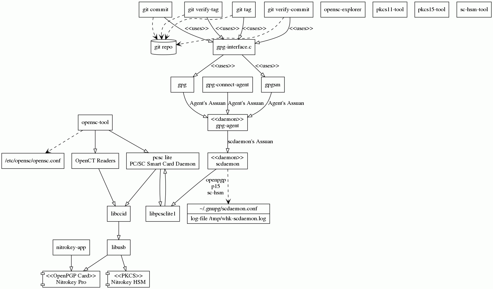

#+TITLE: gpg configuration
#+AUTHOR: whk
#+DATE: 2021-04-01
#+STARTUP: content
#+DESCRIPTION: Configuration of gpg and related tools
#+HTML_DOCTYPE: html5

* Structure

  

#+CAPTION: gpg dependencies
#+ATTR_HTML: :usemap "#gpg"
#+begin_src dot :file gpg.png :cmdline -Tcmapx -ogpg.map -Tgif -ogpg.png :eval no-export
  digraph gpg {
    # Default Attributes
    fontsize=8
    # Default node Attributes
    node [shape = "record"]
    # default edge attributes
    edge [arrowhead=normal label="" style=solid labelURL=""]

    ## Nitrokey Hardware Tokens
    nitrokeyPro [label="<<OpenPGP Card>>\nNitrokey Pro" shape="component"]
    nitrokeyHSM [label="<<PKCS>>\nNitrokey HSM" shape="component"]

    ## USB interface
    libusb
    edge [arrowhead=onormal style=solid label="" labelURL=""]
    libusb -> nitrokeyPro
    libusb -> nitrokeyHSM

    ## Hardware drivers
    libpcsclite1 
    pcscd [label="pcsc lite\nPC/SC Smart Card Daemon" URL="https://pcsclite.apdu.fr/"]
    libccid [label="libccid" URL="https://ccid.apdu.fr/"]

    libpcsclite1 -> pcscd
    pcscd -> libpcsclite1

    pcscd -> libccid
    libccid -> libusb

    ####### Commands
    ### gnupg
    gpg
    gpgAgent [label="\<\<daemon\>\>\ngpg-agent" URL="https://www.gnupg.org/documentation/manuals/gnupg/Invoking-GPG_002dAGENT.html"]
    gpgConnectAgent [label="gpg-connect-agent"]
    #gpgWksClient [label="gpg-wks-client"]
    #gpgconf
    gpgsm

    scdaemon [label="\<\<daemon\>\>\nscdaemon" URL="https://www.gnupg.org/documentation/manuals/gnupg/Invoking-SCDAEMON.html"]
    scdaemonConf [label="{~/.gnupg/scdaemon.conf|log-file /tmp/whk-scdaemon.log}"]
    edge [arrowhead=vee style=dashed label="" labelURL=""] # Depends
    scdaemon -> scdaemonConf
    #watchgnupg
    ### nitrokey
    nitrokeyApp [label="nitrokey-app"]

    ### opensc
    openscExplorer [label="opensc-explorer"]
    openscTool [label="opensc-tool"]
    pkcs11Tool [label="pkcs11-tool"]
    pkcs15Tool [label="pkcs15-tool"]
    scHSMTool  [label="sc-hsm-tool"]
    openct [label="OpenCT Readers" URL="https://github.com/OpenSC/openct/wiki"]
    openscConf [label="/etc/opensc/opensc.conf"]
    edge [arrowhead=onormal style=solid label="" labelURL=""]
    openscTool -> openct
    openscTool -> pcscd
    edge [arrowhead=vee style=dashed] # Depends
    openscTool -> openscConf

    ### git
    gitTag [label="git tag"]
    gitVerifyTag [label="git verify-tag"]
    gitCommit [label="git commit"]
    gitVerifyCommit [label="git verify-commit"]
    gitRepository [label="git repo" shape="cylinder"]
    gpgInterface [label="gpg-interface.c" URL="https://github.com/git/git/blob/master/gpg-interface.c"]

    edge [arrowhead=vee style=dashed label="" labelURL=""] # Depends
    gitTag -> gitRepository
    gitVerifyTag -> gitRepository
    gitCommit -> gitRepository
    gitVerifyCommit -> gitRepository
    edge [arrowhead=onormal label="<<uses>>" style=solid] #uses
    gitTag -> gpgInterface
    gitVerifyTag -> gpgInterface
    gitCommit -> gpgInterface
    gitVerifyCommit -> gpgInterface
    gpgInterface -> gpg
    gpgInterface -> gpgsm
    edge [arrowhead=onormal label="Agent's Assuan" labelURL="https://www.gnupg.org/documentation/manuals/gnupg/Agent-Protocol.html"]
    gpg -> gpgAgent
    gpgsm -> gpgAgent
    gpgConnectAgent -> gpgAgent
    edge [arrowhead=onormal style=solid label="" labelURL=""]
    gpgAgent -> scdaemon [label="scdaemon's Assuan" labelURL="https://www.gnupg.org/documentation/manuals/gnupg/Scdaemon-Protocol.html"]
    scdaemon -> libpcsclite1 [label="openpgp\np15\nsc-hsm"]
    nitrokeyApp -> nitrokeyPro
    openct -> libccid
  }
#+end_src

#+CAPTION: gpg dependencies
#+ATTR_HTML: :usemap #gpg
#+RESULTS:

#+INCLUDE: "gpg.map" export html

** TODO Include of file appears to happen before execution can that be switched

* Software view of the world

** opensc-tool

#+begin_src bash :results verbatim :eval no-export :exports both
  echo "# opensc info ##############################"
  opensc-tool --info
  echo "# opensc drivers ###########################"
  opensc-tool --list-drivers
  echo "# readers...     ###########################"
  opensc-tool --list-readers
  echo "# Nitrokey Pro (in use by scdaemon) ####################"
  opensc-tool --reader 0 --name 2>&1
  echo "# But Nitrokey HSM can be commanded ########"
  opensc-tool --reader 1 --name
#+end_src

#+RESULTS:
#+begin_example
# opensc info ##############################
OpenSC 0.20.0 [gcc  7.5.0]
Enabled features: locking zlib readline openssl pcsc(libpcsclite.so.1)
# opensc drivers ###########################
Configured card drivers:
  cardos           Siemens CardOS
  flex             Schlumberger Multiflex/Cryptoflex
  cyberflex        Schlumberger Cyberflex
  gpk              Gemplus GPK
  gemsafeV1        Gemalto GemSafe V1 applet
  asepcos          Athena ASEPCOS
  starcos          STARCOS
  tcos             TCOS 3.0
  oberthur         Oberthur AuthentIC.v2/CosmopolIC.v4
  authentic        Oberthur AuthentIC v3.1
  iasecc           IAS-ECC
  belpic           Belpic cards
  incrypto34       Incard Incripto34
  akis             TUBITAK UEKAE AKIS
  entersafe        entersafe
  epass2003        epass2003
  rutoken          Rutoken driver
  rutoken_ecp      Rutoken ECP and Lite driver
  myeid            MyEID cards with PKCS#15 applet
  dnie             DNIe: Spanish eID card
  MaskTech         MaskTech Smart Card
  atrust-acos      A-Trust ACOS cards
  westcos          WESTCOS compatible cards
  esteid2018       EstEID 2018
  coolkey          COOLKEY
  muscle           MuscleApplet
  sc-hsm           SmartCard-HSM
  mcrd             MICARDO 2.1 / EstEID 3.0 - 3.5
  setcos           Setec cards
  PIV-II           Personal Identity Verification Card
  cac              Common Access Card (CAC)
  itacns           Italian CNS
  isoApplet        Javacard with IsoApplet
  gids             GIDS Smart Card
  openpgp          OpenPGP card
  jpki             JPKI(Japanese Individual Number Cards)
  npa              German ID card (neuer Personalausweis, nPA)
  cac1             Common Access Card (CAC 1)
  default          Default driver for unknown cards
# readers...     ###########################
# Detected readers (pcsc)
Nr.  Card  Features  Name
0    Yes             Nitrokey Nitrokey Pro (00000000000000000000A391) 00 00
1    Yes             Nitrokey Nitrokey HSM (DENK01051320000         ) 01 00
# Nitrokey Pro in use?? ####################
Failed to connect to card: Reader in use by another application
# But Nitrokey HSM can be commanded ########
SmartCard-HSM version 3.4
#+end_example

** scdaemon

- Do I need to stop pcscd or force usage of ccid driver?
   - Stopping it ~service pcscd stop~ allows scdaemon to switch between cards using

#+begin_example
whk@behemouth:~$  gpg-connect-agent 'SCD SERIALNO' /bye
S SERIALNO 44454E4B30313035313332
OK
whk@behemouth:~$ gpg-connect-agent 'SCD SERIALNO --demand=D27600012401030400050000A3910000' /bye
S SERIALNO D27600012401030400050000A3910000
OK
whk@behemouth:~$ gpg-connect-agent 'SCD SERIALNO' /bye
S SERIALNO D27600012401030400050000A3910000
OK
whk@behemouth:~$ gpg-connect-agent 'SCD SERIALNO --demand=44454E4B30313035313332' /bye
S SERIALNO 44454E4B30313035313332
OK
whk@behemouth:~$  gpg-connect-agent 'SCD SERIALNO' /bye
S SERIALNO 44454E4B30313035313332
OK

gpg-connect-agent 'SCD getinfo card_list' /bye
S SERIALNO 44454E4B30313035313332
S SERIALNO D27600012401030400050000A3910000
OK

#+end_example

- scdaemon only connects to one card at a time
   - [[https://security.stackexchange.com/questions/233916/gnupg-connecting-to-specific-card-reader-when-multiple-reader-available][smartcard - GnuPG - connecting to specific card reader when multiple reader available]]
   - may be version issue [[https://dev.gnupg.org/T1621][T1621 Support multple cards (not just readers)]]
   - turning off pcscd ( ~service pcscd stop~ ) allows scdaemon to see
      both cards and to switch between them. But default install of 

#+begin_example

whk@behemouth:~$ gpg-connect-agent 'SCD getinfo card_list' /bye
S SERIALNO 44454E4B30313035313332
S SERIALNO D27600012401030400050000A3910000
OK
whk@behemouth:~$  gpg-connect-agent 'SCD SERIALNO' /bye
S SERIALNO 44454E4B30313035313332
OK
whk@behemouth:~$ gpg-connect-agent 'SCD SERIALNO --demand=D27600012401030400050000A3910000' /bye
S SERIALNO D27600012401030400050000A3910000
OK
whk@behemouth:~$ gpg-connect-agent 'SCD SERIALNO' /bye
S SERIALNO D27600012401030400050000A3910000
OK
whk@behemouth:~$ gpg-connect-agent 'SCD SERIALNO --demand=44454E4B30313035313332' /bye
S SERIALNO 44454E4B30313035313332
OK
whk@behemouth:~$  gpg-connect-agent 'SCD SERIALNO' /bye
S SERIALNO 44454E4B30313035313332
OK
whk@behemouth:~$ gpg-connect-agent 'SCD LEARN' /bye
S READER 20A0:4230:DENK01051320000%20%20%20%20%20%20%20%20%20:0
S SERIALNO 44454E4B30313035313332
INQUIRE KNOWNCARDP 44454E4B30313035313332
ERR 67109141 IPC call has been cancelled <GPG Agent>
whk@behemouth:~$ gpg-connect-agent 'SCD SERIALNO --demand=D27600012401030400050000A3910000' /bye
S SERIALNO D27600012401030400050000A3910000
OK
whk@behemouth:~$ gpg-connect-agent 'SCD LEARN' /bye
S READER 20A0:4108:00000000000000000000A391:0
S SERIALNO D27600012401030400050000A3910000
INQUIRE KNOWNCARDP D27600012401030400050000A3910000
ERR 67109141 IPC call has been cancelled <GPG Agent>

#+end_example

#+begin_src bash :results verbatim :eval no-export :exports both
gpg-connect-agent 'SCD help' /bye
#+end_src

#+RESULTS:
#+begin_example
# NOP
# CANCEL
# OPTION
# BYE
# AUTH
# RESET
# END
# HELP
# SERIALNO [--demand=<serialno>] [<apptype>]
# LEARN [--force] [--keypairinfo]
# READCERT <hexified_certid>|<keyid>
# READKEY [--advanced] <keyid>
# SETDATA [--append] <hexstring>
# PKSIGN [--hash=[rmd160|sha{1,224,256,384,512}|md5]] <hexified_id>
# PKAUTH <hexified_id>
# PKDECRYPT <hexified_id>
# INPUT
# OUTPUT
# GETATTR <name>
# SETATTR <name> <value> 
# WRITECERT <hexified_certid>
# WRITEKEY [--force] <keyid> 
# GENKEY [--force] [--timestamp=<isodate>] <no>
# RANDOM <nbytes>
# PASSWD [--reset] [--nullpin] <chvno>
# CHECKPIN <idstr>
# LOCK [--wait]
# UNLOCK
# GETINFO <what>
# RESTART
# DISCONNECT
# APDU [--[dump-]atr] [--more] [--exlen[=N]] [hexstring]
# KILLSCD
OK
#+end_example

** gpg-agent

#+begin_src bash :results verbatim :eval no-export :exports both
gpg-connect-agent 'help' /bye
#+end_src

#+RESULTS:
#+begin_example
# NOP
# CANCEL
# OPTION
# BYE
# AUTH
# RESET
# END
# HELP
# GETEVENTCOUNTER
# ISTRUSTED <hexstring_with_fingerprint>
# HAVEKEY <hexstrings_with_keygrips>
# KEYINFO [--[ssh-]list] [--data] [--ssh-fpr] [--with-ssh] <keygrip>
# SIGKEY <hexstring_with_keygrip>
# SETKEY
# SETKEYDESC plus_percent_escaped_string
# SETHASH (--hash=<name>)|(<algonumber>) <hexstring>
# PKSIGN [<options>] [<cache_nonce>]
# PKDECRYPT [<options>]
# GENKEY [--no-protection] [--preset] [--inq-passwd]
# READKEY <hexstring_with_keygrip>
# GET_PASSPHRASE [--data] [--check] [--no-ask] [--repeat[=N]]
# PRESET_PASSPHRASE [--inquire] <string_or_keygrip> <timeout> [<hexstring>]
# CLEAR_PASSPHRASE [--mode=normal] <cache_id>
# GET_CONFIRMATION <description>
# LISTTRUSTED
# MARKTRUSTED <hexstring_with_fingerprint> <flag> <display_name>
# LEARN [--send] [--sendinfo] [--force]
# PASSWD [--cache-nonce=<c>] [--passwd-nonce=<s>] [--preset]
# INPUT
# OUTPUT
# SCD <commands to pass to the scdaemon>
# KEYWRAP_KEY [--clear] <mode>
# IMPORT_KEY [--unattended] [--force] [<cache_nonce>]
# EXPORT_KEY [--cache-nonce=<nonce>] [--openpgp] <hexstring_with_keygrip>
# DELETE_KEY [--force|--stub-only] <hexstring_with_keygrip>
# GETVAL <key>
# PUTVAL <key> [<percent_escaped_value>]
# UPDATESTARTUPTTY
# KILLAGENT
# RELOADAGENT
# GETINFO <what>
# KEYTOCARD [--force] <hexstring_with_keygrip> <serialno> <id> <timestamp>
OK
#+end_example
   
* Identities

** develop@whk-name

   My development keys

   *IMPORTANT* Make sure keys are backed up first

   - Card: Nitrokey Nitrokey Pro
   - Serial Number: 0005 0000A391
    
*** Set initial card information

    gpg --card-edit
    Admin
    name # change card holder's name
      Cardholder's surname: Knight
      Cardholder's given name: Warren
    login # change the login name
      Login data (account name): whk
    lang # change the language preference
      Language preferences: en
    passwd
     1 - change PIN
     --- Make Changes ---
    Q
    verify
     
*** Import certificates

    - src: [[https://www.nitrokey.com/documentation/openpgp-create-backup#key-import][OpenPGP Key Generation With Backup]]

      gpg --edit-key develop@whk.name
      keytocard
      1        #  (1) Signature key
      key 1
      keytocard
      2        # (2) Encryption key
      key 1
      key 2
      keytocard
      3        # (3) Authentication key
      q
      y

*** Public key

#+begin_example
-----BEGIN PGP PUBLIC KEY BLOCK-----

mQINBFSy/icBEAC8uxrd6V7DamKNr7y9wJkUog079iz8KOaXZxGhXyo4RHNiUWro
V8LfVEs0CWMMMoJKqGO4bdt0XAPOYL9iE4ONqR1pEeg0oNgkHlFggSDHjjAjtPVN
/ISBO8V1CX8ArcHB1XVm7NnZXncqiCKCuooiPWTe/scIUzleC1SCutgVO6hS25/Y
xcjllGwgcRG5RV0+woi0KYOOzRjIgTAz9enFRWtdZLj3rd49YT/vmx4i2IV4oCdA
6WtE5KW765tiYeNKEs3ldgxe98ONmU2NUIKDuoAEoemTI4b3gfT6yTM5zdjH1FGx
MsXOuAmZMKw2UPPsnMylN3ctC6igsMYCCUY7AVTxsX74h6biKN6t3T7hFcSyC7AX
cuZYZfdSjlSmBf3jvH1diZz3NP+G7mnm+ozaYJpMA52qgJny3s1Ac+xUDP9k89HR
GHwSj3TKuZgnj/0Ht5nyW6mk/2/JZBTlzLzTTvkFavT02jhXdjN2G1AaqKPXaPYd
ZNACXglpVuLj6zKOTNHM8//jefH18Ye15CDvh/wZ1gAG8dKofTkvQf3pX6Hzjp9Q
ALP3vD2pY+0hJ/M3KosytUPoQz+5ZgvHCQ0mdoBy8kSunr+6TFFo2ns8FhZYEoIm
Bcgjk583EfNVm87oPnBYvuVtssCY0+WCpv2nTpY/hyZXwsGpW5QNmd2fQQARAQAB
tC5XYXJyZW4gSCBLbmlnaHQgKERldiBlbWFpbCkgPGRldmVsb3BAd2hrLm5hbWU+
iQJRBBMBCgA7AhsDBQsJCAcCBhUKCQgLAgQWAgMBAh4BAheAFiEE7KIVVdkaOkTd
bnB1j1DMZTwBvwEFAmAlm/ICGQEACgkQj1DMZTwBvwEI/g//RMMpSlRzmGubo2mY
Ad1X9pqg4BtzmRpTYFdlgZJOvFPgSTWSNWkd1zM3c14LguUKzrzVI93vt6RQglws
n1c+Jf+r12/rzMmuWtNHL+tuYwFkrj6P79AKrLDj/V53rS+1si5/ByTSz2pEjbB0
hF9EtwnEm4q4vL5SE5Ll2xHfJI8az+hASXnj3aLtKbyxjlW1Jo110moc4B12OBYg
ou+JpgOgtGw0+Tss6GnhmO5T8N3GpDRUo2TTzqmKyQbo31hFgpg0lk98xdWNU94+
73o5K+prxvYsD3v25ZC+Ur9C/tHwkBq8pGS5hpJVjwQyJdwWLM+H8gLGNorvI5EM
1fplrzwp3h37gJ4NdQ8vLIXVnXIjHCMUN9yPaveffqH9DxNXV12VefU8kYhMV6kc
k8z5MAITYvfxvBsqpaPo2LEzBR8lkyZWWsPoaZCy0VbbpkhvKzAOfOyDfkRqivA8
QIY5F60AJXpyInDbThywQlL9nR6sAlE2M7ISDcRU7UoIeBB8F6hJmQu77WkuZRKE
QnT6SunNgjw5Wir3kd/su4deuX0yDhIKqmYMEQKGAeccT1S9PNMoeWS921jbYn5E
Sq3JJGZAP374++wg2yQ5sNaYUD4Uc4fenKd5cuGOnHcytHuyS+Ai9+elCM1ljzlZ
mPye1U2As/IkYwgDyDxDkha3uA+0NGh0dHBzOi8vd2hrLm5hbWUvYWJvdXQvbWUv
ICh3aGspIDxuby1yZXBseUB3aGsubmFtZT6JAlAEEwECADoCGwMHCwkIBwMCAQYV
CAIJCgsEFgIDAQIeAQIXgBYhBOyiFVXZGjpE3W5wdY9QzGU8Ab8BBQJgJZvyAAoJ
EI9QzGU8Ab8B06UP+gN//62kKykPR69ydRvNoXP96hKs0rMt0+naaDl6/UdeOEOX
oBZeouc/3/ls9J3KRLejcaWRMgoqEi7aTRGXFi4qoHzGvRWGzgtkOhpuKJOEt+tv
t4VS6T9C3m0AqhO/V9X13c1u7cozrLIzCd9s70STiyOOB6FWvo4xea7bIiRXRY1G
aZzfEpeIIyqodcKPZ1/gj8qJaFtwDHJQTvIkWfKbsUucUYHwMdd/Vk09dGU430K0
bxa/Q7ykZM9wjtQUa7RsvaabtCOIvGUatHIUk1w3CwWCwEzyhRq/iqAE9hCFdibn
GYs9DdWXKhD6+sy2Bp7Z3yqjFIwFz3f5ipxSAz7C5PH59xEXQg8zvExfBc4TktpZ
CIu4H3ApWB1iDaXti8QPphrHJyi7uhKGhqk7LMnB0NGX9ooLP/UiGtVGKahejL1Q
hCSryt3r+G/wyIstfy9YcetUWkSDMtgEYDLYgmDM0pRHY2RM4fEeJ3ypS92TicTn
IMYt1Ngx51wDcqRbF6y3COZb7s3WhF4+HmLieIWuTvPUW2axD9amQUsWQtP6sDm1
e3zKnGCRe0xniK478Tduh9xeQCnUmr3CmKTR5SnalApOLQFaXlUcngXTZbrJGE4Q
oIq+JUsZu/zPN9MP4iaBXgcFdwjhqWdm3KIP09k7Pdx//rZi+HYZzEq4Yy4uuQIN
BFSy/icBEADnSZblK3ucGzrJyNfG3Q35DqZ/FZD/vctCdObM6X10tx5yXRdOUY4N
NN0XdhY9ctcg4HFfdtNnSrV305yp1O1VA+d8gzZ6WJBiwaRFP05l47Ol7ATFd9wm
vA+hbRroCzsOpNfHxLvHgYMg+/qB6jKpn/P9wnsUoKvrBoqLzCjQGNlPUWnQl7ln
6t5pu494ZqaXu53c9/W8I1M4ZMZ3Cn1sbNRkr2ln4XBwUqsgtUjL/R3L2Nw5gCOw
7pXKDVqEQpDxxji00G9piQpXiVVXawVWonroIPJgest45A35RUfsGV0YT+0PpasI
echtUUjJ0aH1uECE+yUgG8j0bU6U799hxYRhYZXVvuz8K77EMNi9URhy3zy+BS/0
KtJcqJbY5KLKDpXthpFGAaTF0pJvmAZ6hs+iTFcKnM03c43dljG7fb9vf+AyDsku
jqOdFhyltYaAMoZDhO7+/CfgZvFDGN0VNHVkNJM/4op4PQdTRuydMipWYR0unFN5
BWaJAvXnugpOLThSW4eDKjjsKlHNQKdzvj3AsPT7+XgaZSDjBRJRikviP0qsgu9O
nNJ51LNgcH2jx7swh8y6PNszBD7wS76MaPj0d2hq7bdeocmHn11LRbWPfBJtLSDG
2YgnZQCoYAvnpP/QuOsdXSg/HwAXEFw4YNeXrKtQxONiRSsHVpglxQARAQABiQIf
BBgBAgAJBQJUsv4nAhsMAAoJEI9QzGU8Ab8BEbkP/1PAHAPjVgkfs4gEicaFydVy
8Uyjn9EGxq15GM7p0pyOopFRhUqQieRLDQa0X4fNR8oXlDstkzaSs8EJMIL3jt0c
+xKvSkMT7YCFs8uUPMAJ6CvR0tzFSCBN2XzmS2bINFgH4idlCRVQJ9YtyBfx/Qev
11Q0qEy8muwrZzb+Gp5T5Amhc0noX/BdOqet8z8qGCV8a8SX/jdT8GcJPJT8YYxD
r36UmXXNKuocUm9R8LU7lnSuJ3caeMcOanaQL8PBoFSj+pHLGHhTqwDeHD5u62Pc
wlIRJpuxeS3WEFtWzXjhZTyeyVCV9ip0jjaSN0rGy6l0kPlmnw74IyXCrUJVeTp0
9xFB+MPlVYEEYLt0QV6nxKWkk8bdBWtMK2NqGXtWvn6i+55ysZuEHgt6nJS0Tvdi
XTK3kWDT7eRQ7xTv9KRSz8571zK6jK7ErLrnR9+ZPoFUp9fdQqeFrI2McmSrPKX/
zouix6KLbRvsXPO9Pp/16I44W1Sca4gYJJzVFcxkwCBSP5kDw8WArGWx6V+JIdP1
wP2uev2DMYRD4/4A3mrSmhYMvSdkrkuD9NpMXuGHiiPS2TqN1lq9ZIyFj518/j9J
4aTI71U4JQ6gkeK3tV6ZAzNnIFCo5d+PtzLnjwshkVYdiBKmJ+msFyvJQvHqf+EB
XJivvOTiCGuCfQgK7F3KuQINBGBFQOcBEAChgStj6rTDF5kisuOYQWqD5io38BZF
qb9BpxiiNqaul2iDehtMzJf4lvIF39k8vu2NjPXcGrAiDIrOyf/q62ZfGUx8v0ac
vXv3cB2YYcRsM3aq2QMCq+f1i+IbLhSAbzwZwhKuLcbjaeL8O4y2pwI8G5t9uCRc
zhjaBNO7+3JW9hiyzKexot5jipW4AB+h1NhAn3SBxyjRQdNKsWG0wCmN41Dv+g32
gSFy+TYYqo+YBxRDautD5w8WgqX2sjz+10pgPVEaJLEw5mzZOWtoVgpPo7iXefEV
9MjhdFccMZ6PAZ9tcS5gT8sLo6+/zJZtcBSPZmayIyvKPATZ/bESmvuPyaWCYUgH
QlRADZyXxeZrY7hSoXbYZafm2faarlsJwDvE1nbrUfK0JX0EJ4xMqjXVNbbHfHzm
51ecPb1sso3dY5/7G1r5l8vieUpzDNPjRgDZCb+aDmIUBZcYaFPkgr9dc1p8gOKm
fsI8kf+R2LwmmoAeeaF7jf1M+te12aGHeQ/nasJCnY2v2CQejK+DAoOfMlumyrhM
jHS1UioPT4+C9yWvr/V6O/1c+u9QKGgi+7AIkVp9ijrFDHUv7A6hS3z3BZ5GM1ZA
bVWfq+jQyEAghjtAv9ZCMXVDGcQwxnWuFYLEqBaKrVUUSJMdD+PzGLCHs78pIGkY
Embswc+RJiYCHQARAQABiQRsBBgBCgAgFiEE7KIVVdkaOkTdbnB1j1DMZTwBvwEF
AmBFQ3ICGyACQMF0IAQZAQoAHRYhBGCSJ8cWt9ZH8EWolva+3ZkOj7dJBQJgRUDn
AAoJEPa+3ZkOj7dJDEMP/2inYTWkaETDxHlnsoCPDB/TPKecGMHscWLjtb0FavNX
QJjhFzK0pu68IQJKnvwi/10X91y4etUolfDRTmAhIHQtuCVnVpil5Zrv7iOIgugw
KiK1/zcglFe9WmMb0Gb+zQyf/EWXrf5ehJJ8ncs+bGX1KWmaAnR90uvspqZgl6I8
9cwdhIiHnkLJKv2ym+mi2bzzluauK+yXEGa7b5jG+hO8cxtG68yzogwyoN/hefg6
XSCJLF8E6at+AsF6aTPuUS1hKvxk7PG4ZqzVRLzPOWkxy5Kodce6R+C45G1gcYxb
U7BSC15RWxlV0qaHNdqmjS1VRTWLp6DRlE1gLBmI7RwB+oTc4gTWaIHLtGx2bnco
GQQWuEl2PKBZOnLFEBNUwt9nbRuCaNSuCNzp8d6wgYPk7S+cQ8iBbQghVzoipRsp
2M8W3omYJAmWb7+y4ljWVIzeq9bIIJ8nskjgkq2XSNtGwjfq27KxAvv8XZkd+w71
ZuYVA49pIN9Iu4B89EMR6C+vlhRT6GLwe62rZ9zK893atElk5xBZl8wj/d+AGIdY
ak8uCrf8jH/QAowcM3zvy5BzrvYEBGgBs5ZNPiwLNuioSlKJmnMXzv7cE/l3rbDB
YhBMPVxvx5M9BUcvdh6oZk6/HqAurbQ8oOX7fMpew+yMg+Qoj81SyiJ9gseR5tKW
CRCPUMxlPAG/AVhyD/9HJwFamCTnES6aVtQB+p+udW2KJzV/HMsaAk/K/V4dDfT+
JoRITwTHujr1KY2BS6gjyNJkOVotiqFnwo0fZQ/WKhesyAgOGs7SNV4ImkbbNHw5
BAl1BmU4CR84rC73WvbKF9d+arKuKctuXQqphFDzWx2XG7OIGOU49zkYIMZ+/OJZ
bIKVHn1VF5wgctB5g/Y1aAuL5uf4/ecRtSJ8OEWOwtc1V1DuEGvYymXGZSpLUjG5
ObXHB3Qw49rB12IO4v7MN+6d/kE3/fqYHApzdoWhp7l7u4oQW0jw3eZTix4ku27+
yPaKVhZmWEYqqok1kwRmEX9IbpxOezLWPhuMoeDJH+CqouARDzwvyzsgl6y/G+/F
l+OSdo25ckuD0SpbfNOThMWfiLj6v1WOvUpr8QXjYjM370JSARDTW8eZmiApbxtE
Iic2n4aylfxS7wTmKacboomF4g2rPhUWnVb1O7OsYlzyCIbJYWX2uOMRY/nnbcTG
8y/QdyLvclYtJwkyMhHMdI9nuHhvAFzORboqwhcPYIacRqI4ALEjhqoK8Tl8W85P
sMr9L/4daOMPn309hLPCq/bOXWHf/6F5QSnKjPE7KceDSnI6Ee16J+3tGwFrogMv
CiCUvQrpl+FMTAfDGdQw115JUandoTR+9NAzXWhyA7qNsVokRYqPMndZ1a8R7w==
=oDbC
-----END PGP PUBLIC KEY BLOCK-----
#+end_example

*** TODO Use gpg authentication subkey for ssh
    - SRC:
      - [[https://www.linode.com/docs/guides/gpg-key-for-ssh-authentication/#serve-your-gpg-key-instead-of-an-ssh-key][linode - How to use a GPG key for SSH authentication]]
      - gpg-agent man page
      - [[https://askubuntu.com/questions/50171/how-do-i-use-gpg-agent-as-with-ssh-agentssh-add][How do I use gpg-agent as with ssh-agent+ssh-add]]
      - [[https://www.bootc.net/archives/2013/06/09/my-perfect-gnupg-ssh-agent-setup/][My Perfect GnuPG / SSH Agent Setup]]
        - [[https://wiki.bootc.net/gnupg/agent-config-linux.html][Docs » GnuPG » Agent Configuration: Linux -- bootc's wiki latest documentation]]
** testrsa4096-noreply@whk-name

   
pkcs11-tool --login --login-type user --keypairgen --label testrsa4096 --key-type rsa:4096 --usage-sign
pkcs11-tool --login --login-type user --keypairgen --id 7 --key-type rsa:4096

whk@behemouth:~/.gnupg$ pkcs11-tool --login --login-type user --keypairgen --id 7 --key-type rsa:4096
Using slot 0 with a present token (0x0)
Logging in to "SmartCard-HSM (UserPIN)".
Please enter User PIN: 
Key pair generated:
Private Key Object; RSA 
  label:      Private Key
  ID:         07
  Usage:      decrypt, sign, unwrap
  Access:     none
Public Key Object; RSA 4096 bits
  label:      Private Key
  ID:         07
  Usage:      encrypt, verify, wrap
  Access:     none

  
engine -t dynamic 
engine -pre SO_PATH:/usr/lib/engines/engine_pkcs11.so -pre ID:pkcs11 -pre LIST_ADD:1 -pre LOAD -pre MODULE_PATH:/usr/lib/x86_64-linux-gnu/pkcs11/opensc-pkcs11.so

* Hardware Tokens
** Nitrokey App

   Can be used to maintain/use the Nitrokey Pro

   sudo add-apt-repository ppa:nitrokey/nitrokey
   sudo apt install nitrokey-app

** Nitrokey Pro

*** Getting started

    - Src: [[https://www.nitrokey.com/documentation/installation#p:nitrokey-pro&os:linux][Getting Started | Nitrokey]]

**** Install libccid

     - ~sudo apt-get install libccid~

**** Verify card

     - Src: [[https://www.gnupg.org/howtos/card-howto/en/ch03.html][Chapter 3. Administrating the Card]]
     - ~gpg --card-status~

**** Admin pin

     gpg --card-edit
     admin
     passwd
     3 - Change Admin PIN
     --Make the changes--
     Q
     quit
    

    
*** Configure user keys

** Nitrokey HSM

   - References
     - [[https://github.com/Nitrokey/opensc-build][Nitrokey/opensc-build: Quick builds of OpenSC for Ubuntu and Debian]]
     - [[https://github.com/OpenSC/OpenSC/wiki/SmartCardHSM][SmartCardHSM - OpenSC/OpenSC Wiki]]
  
*** Get latest software

     - src: [[https://github.com/Nitrokey/opensc-build][Nitrokey/opensc-build: Quick builds of OpenSC for Ubuntu and Debian]]

       - opensc-0.20.0-1
       - opensc-pkcs11-0.20.0-1

*** Install

   gdebi-gtk opensc-pkcs11_0.20.0-1~nitrokey_amd64.deb
   gdebi-gtk opensc_0.20.0-1~nitrokey_amd64.deb

*** SOPIN

    #+begin_src sh
     mkdir -p ~/secrets/nitroKeyHsm
     pkcs11-tool --generate-random 8 \
	 | hexdump -v -e '"%02X"' \
	 | gpg --encrypt --recipient develop@whk.name \
	       --armor > ~/secrets/nitroKeyHsm/sopin.asc
     sopin=`gpg --decrypt ~/secrets/nitroKeyHsm/sopin.asc`
   #+end_src

*** DKEK

   #+begin_src sh
     mkdir -p ~/secrets/nitroKeyHsm
     pkcs11-tool --generate-random 64 \
	 | base64 --wrap=0 \
	 | gpg --encrypt --recipient develop@whk.name \
	       --armor > ~/secrets/nitroKeyHsm/dkekpass.asc
     dkekpass=`gpg --decrypt  ~/secrets/nitroKeyHsm/dkekpass.asc`
     sc-hsm-tool --create-dkek-share ~/secrets/nitroKeyHsm/dkek-share-1.pbe --password ${dkekpass}
   #+end_src

*** Initialize

   #+begin_src sh
     sc-hsm-tool --initialize --so-pin ${sopin} --pin XXXXXXXXX --dkek-shares 1 --pin-retry 3
     sc-hsm-tool --import-dkek-share  ~/secrets/nitroKeyHsm/dkek-share-1.pbe --password ${dkekpass}
   #+end_src

*** Details

   #+begin_src sh
     pkcs15-tool --dump
   #+end_src

  
 #+begin_example
 Using reader with a card: Nitrokey Nitrokey HSM (DENK01051320000         ) 00 00
 PKCS#15 Card [SmartCard-HSM]:
	 Version        : 0
	 Serial number  : DENK0105132
	 Manufacturer ID: www.CardContact.de
	 Flags          : 

 PIN [UserPIN]
	 Object Flags   : [0x03], private, modifiable
	 Auth ID        : 02
	 ID             : 01
	 Flags          : [0x812], local, initialized, exchangeRefData
	 Length         : min_len:6, max_len:15, stored_len:0
	 Pad char       : 0x00
	 Reference      : 129 (0x81)
	 Type           : ascii-numeric
	 Path           : e82b0601040181c31f0201::
	 Tries left     : 3

 PIN [SOPIN]
	 Object Flags   : [0x01], private
	 ID             : 02
	 Flags          : [0x9A], local, unblock-disabled, initialized, soPin
	 Length         : min_len:16, max_len:16, stored_len:0
	 Pad char       : 0x00
	 Reference      : 136 (0x88)
	 Type           : bcd
	 Path           : e82b0601040181c31f0201::
	 Tries left     : 15
 #+end_example

* Misc
** GPG Keygrip Calculation
*** RSA4096

   - Ref: [[https://crypto.stackexchange.com/a/81518][Answer to "Computing PGP ... keygrips" skaht 2020-06-24]]
   - [[https://www.gnupg.org/documentation/manuals/gcrypt/index.html][The Libgcrypt Library]]
   - [[https://github.com/gpg/gnupg/blob/283ccbc824d8062b86e27818a84ab5a29facd7a5/g10/keyid.c#L1030][keyid.c - keygrip_from_pk]]
     #+begin_src c
       err = gcry_sexp_build (&s_pkey, NULL,
			      "(public-key(rsa(n%m)(e%m)))",
			      pk->pkey[0], pk->pkey[1]);
     #+end_src

   - [[https://github.com/gpg/gnupg/blob/7f3ce66ec56a5aea6170b7eb1bda5626eb208c83/g10/packet.h#L440][packet.h PKT_public_key->pkey]]

     #+begin_src c
       gcry_mpi_t  pkey[PUBKEY_MAX_NSKEY]; /* Right, NSKEY elements.  */
     #+end_src

   - [[https://www.gnupg.org/documentation/manuals/gcrypt/Data-types.html#Data-types][MPI (multi-precision-integers) library | Data types]]

     #+begin_quote
     Data type: gcry_mpi_t

          This type represents an object to hold an MPI. 
     #+end_quote
