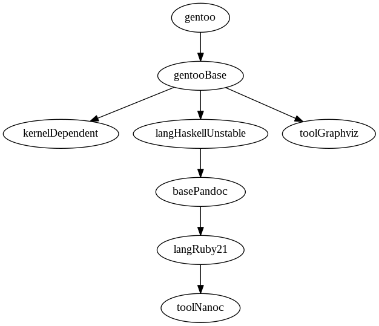

** Assumptions
   :PROPERTIES:
   :CUSTOM_ID: assumptions
   :END:

-  Docker configured for running os
-  Git configured for running os

** Chain to build
   :PROPERTIES:
   :CUSTOM_ID: chain-to-build
   :END:

#+CAPTION: Tool Chain


** build
   :PROPERTIES:
   :CUSTOM_ID: build
   :END:

```bash # Pull the official base gentoo image # TODO: Figure out way to
control this to get fixed image but still get updates # at appropriate
times docker pull gentoo/stage3-amd64-hardened

* Build our base container which is used to generate all the other
containers
  :PROPERTIES:
  :CUSTOM_ID: build-our-base-container-which-is-used-to-generate-all-the-other-containers
  :END:

git clone https://whk.name/src/containers/gentoo-base/gentoo-base.git/
cd gentoo-base # Verify "From" tag in Dockerfile since origin changes at
times vi Dockerfile # Build ./build.sh

* References
  :PROPERTIES:
  :CUSTOM_ID: references
  :END:
